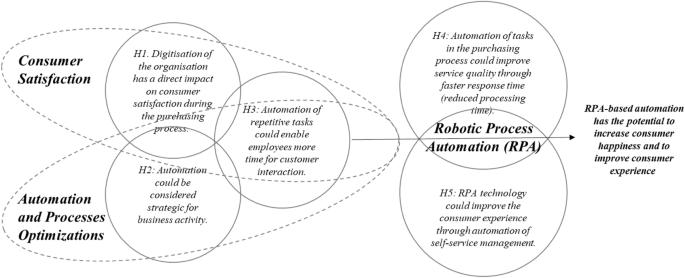
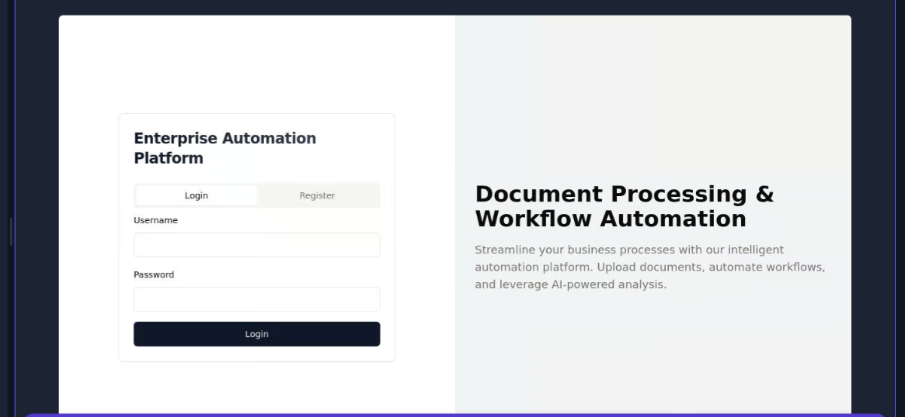

# Enterprise: Intelligent Process Automation

Intelligent Process Automation (IPA) is an AI-driven solution designed to automate repetitive and time-consuming business processes. This project focuses on automating tasks such as data entry, document processing, and customer service interactions. It is intended for businesses and enterprises looking to streamline their operations, reduce manual effort, and improve efficiency through advanced AI technologies.

With the implementation of IPA, organizations can significantly reduce the time spent on routine tasks, allowing employees to focus on more strategic and value-added activities. The AI solutions provided by this project are capable of learning and adapting to various processes, ensuring continuous improvement and optimization.

## Table of Contents
- **Problem Statement**
- **Features**
- **Tech Stack & Tools Used**
- **AI Model Implementation**
- **Testing & Quality Assurance**
- **Security & Compliance**
- **Roadmap (Future Enhancements)**
- **Impact & Benefits**
- **Contribution Guidelines**
- **License**
- **Screenshots)**
- **References & Acknowledgments**

<h2>Problem Statement</h2>
Enterprise: Intelligent Process Automation, AI solutions that can automate repetitive and time-consuming business processes, such as data entry, document processing, and customer service interactions.

## AI-Powered Process Automation- Automates repetitive tasks using AI, NLP, and ML.  
### Features
- **Intelligent Data Processing**: Extracts, validates, and processes structured & unstructured data.
- **Smart Document Understanding**: OCR & NLP-based document processing for invoices, forms, etc.
- **End-to-End Workflow Automation**: Streamlines business operations with RPA & AI bots.
- **Predictive Analytics & Insights**: Uses AI to analyze trends & optimize decision-making.
- **Enterprise-Grade Security & Compliance**: Ensures data privacy, encryption, and regulatory compliance.
- **Seamless Integration with Existing Systems**: Connects with CRMs, ERPs, APIs, and third-party tools.
- **AI Chatbots & Virtual Assistants**: Automates customer interactions with NLP-based chatbots.
- **Auto-Healing & Self-Learning Systems**: Continuously improves processes with AI-driven learning.
- **Real-Time Monitoring & Reporting**: Dashboards and analytics for tracking business performance.

## Tech Stack & Tools Used

- **Frontend:** React.js, Angular, Bootstrap  
- **Backend:** Python (Flask, Django), Node.js  
- **Database:** PostgreSQL, MongoDB  
- **AI & ML:** TensorFlow, OpenAI API, Google Cloud AI  
- **NLP:** spaCy, NLTK, Hugging Face Transformers  
- **Automation:** UiPath, Power Automate for RPA  
- **Security:** Role-based access control (RBAC), OAuth, End-to-end encryption 

## AI Model Implementation
Our **Enterprise Automation System** integrates **Artificial Intelligence (AI), Machine Learning (ML), and Natural Language Processing (NLP)** to automate complex business processes. Below is the step-by-step breakdown of how AI is implemented:

###  *1. Data Collection & Preprocessing*
* Collect structured (databases) and unstructured (OCR text, logs) data.
* Clean and preprocess data by handling missing values and standardizing formats.
* Tokenization and stop-word removal for NLP tasks.

### *2. Feature Engineering & Selection*
* Identify key attributes for automation.
* Apply encoding, normalization, and dimensionality reduction techniques.
* Extract relevant features for training ML models.

### *3. Model Development & Training*
* Train **Machine Learning models** such as **Random Forest, XGBoost, and Neural Networks**.
* Implement **Deep Learning** using **TensorFlow/Keras** for AI-driven decision-making.
* **OCR Models** extract text from scanned documents (Invoices, Contracts, Reports).

### *4. AI-Driven Intelligent Automation*
* **NLP models** analyze and extract key insights from text-based data.
* **OCR (Optical Character Recognition)** automatically processes documents.
* **Chatbots** powered by NLP handle customer queries in real-time.

### *5. Deployment & Continuous Improvement*
* Deploy ML models using **Flask/FastAPI** to serve predictions in real-time.
* Implement feedback loops for continuous model improvement.
* Monitor performance, retrain models periodically, and optimize for efficiency.

Ensuring the reliability and efficiency of the **Enterprise Automation System** requires a structured approach to testing and quality assurance. Below are the key testing strategies used:

### ✅ *1. Unit Testing*
* Validate individual components such as AI models, OCR, and NLP processing units.
* Ensure correct data extraction, processing, and model inference.
* Use **pytest**, **unittest**, and **Jest** for automated testing.

### ✅ *2. Integration Testing*
* Test interaction between AI modules, automation scripts, and backend services.
* Ensure seamless communication between OCR, NLP, and automation tools.
* Validate API endpoints and database transactions.

### ✅ *3. Functional Testing*
* Verify that AI-powered automation performs expected tasks efficiently.
* Test different scenarios for document processing, NLP-based queries, and chatbot interactions.
* Ensure correct predictions, responses, and automated actions.

### ✅ *4. Performance & Scalability Testing*
* Measure system response times under high data loads.
* Optimize AI models for speed and accuracy.
* Use **JMeter** and **Locust** to simulate heavy traffic and load conditions.
  
<h2>Security & Compliance</h2>

- **Data Encryption**: Encrypting sensitive user and business data to prevent unauthorized access.
- **Access Control**: Implementing role-based access control (RBAC) to restrict access to critical data and operations.
- **Regulatory Compliance**: Adhering to industry standards such as **GDPR, HIPAA, and ISO 27001** to ensure data privacy and protection.
- **Audit Logging**: Maintaining detailed logs of system activities for monitoring and compliance reporting.
- **Threat Detection**: Integrating AI-driven security measures to detect and mitigate potential cyber threats in real time.
- **Regular Security Audits**: Conducting periodic security assessments to identify and fix vulnerabilities.

## screenshots




## Roadmap (Future Enhancements)
- Expand AI capabilities to handle more complex document processing tasks.
- Improve Natural Language Processing (NLP) accuracy for better data extraction and contextual understanding.
- Integrate AI-powered anomaly detection for fraud prevention in document processing.
- Enhance predictive analytics for better decision-making in automated workflows.
- Develop a no-code/low-code interface for easier customization by non-technical users.
- Improve integration with more third-party tools like ERPs, CRMs, and cloud storage platforms.
- Implement multilingual support for global business automation.
- Optimize real-time monitoring and reporting with advanced dashboards and analytics.
- Enable AI-driven self-learning mechanisms to adapt automation processes dynamically.
- Introduce voice-based AI assistants for hands-free business process automation.

  ## Impact & Benefits
### Business Impact
- **Increased Efficiency** – Automates repetitive tasks, reducing human intervention and increasing operational speed.  
- **Cost Savings** – Minimizes manual labor costs by automating high-volume business processes.  
- **Scalability** – Enables businesses to scale operations without a proportional increase in workforce.  
- **Improved Accuracy** – Reduces human errors in data processing, ensuring reliable outputs.  
- **Enhanced Decision-Making** – Provides real-time insights and analytics for better business decisions.  

### Benefits for Organizations
- **Productivity Boost** – Employees can focus on higher-value tasks instead of manual, repetitive work.  
- **Seamless Integration** – Works with existing CRMs, ERPs, and third-party business tools.  
- **Regulatory Compliance** – Ensures adherence to industry standards with built-in security and audit mechanisms.  
- **Customer Satisfaction** – Faster response times and automated customer service improve user experience.  
- **Data Security & Privacy** – Implements robust encryption, access control, and compliance with GDPR & HIPAA.  

### AI-Specific Benefits
- **Continuous Learning** – AI-driven automation improves over time with machine learning.  
- **Predictive Insights** – Uses AI analytics to predict trends and optimize business workflows.  
- **Self-Healing Systems** – Automatically detects and resolves process inefficiencies without human intervention.

  <p align="center">
  
</p>

## Contribution Guidelines

If you would like to contribute to the **Intelligent Process Automation (IPA)** project, please follow these guidelines to maintain consistency and quality:  
### 1. Fork & Clone the Repository
- Click the **Fork** button to create a copy of the repository on your GitHub account.
- Clone the repository to your local machine using:  
  ```sh
  git clone git@github.com:jahnavi-gottam/enterprise-automation.git
  cd enterprise-automation


  


